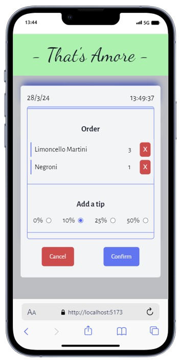
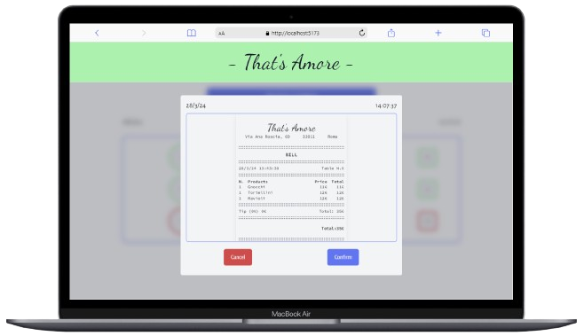

# That's Amore Restaurant Ordering App

## Overview

The That's Amore Restaurant Ordering App is a web application designed for use
in the Italian restaurant "That's Amore" to facilitate order-taking from diners.
The app displays the current date and time, allowing staff to efficiently manage
orders.

Diners can be assigned to specific tables, and orders can be taken directly from
a categorized list of dishes. The app dynamically updates the order summary,
allowing for easy addition and deletion of dishes. Additionally, users can
manually select a tip percentage, and all changes are reflected in a bill
section where details such as start time, dishes, tips, prices, and totals are
displayed.

The app also includes functionality to print the bill. Table statuses are
automatically updated to indicate when a table is busy, and staff can modify
details as needed. All data is persisted using local storage.

The app was designed using Figma and developed using Vite, React, TypeScript,
and Tailwind CSS, with a focus on good programming practices, including separate
folders and files, custom components, and hooks.

## Features

- **Real-Time Date and Time Display**: The app displays the current date and
  time for efficient order management.
- **Table Selection and Order Taking**: Staff can assign diners to specific
  tables and take orders directly from a categorized list of dishes.

- **Dynamic Order Summary**: Orders are dynamically updated, allowing for easy
  addition and deletion of dishes.

- **Bill Section**: A bill section displays details such as start time, dishes,
  tips, prices, and totals, with the ability to print the bill.

- **Table Status Management**: Table statuses are automatically updated to
  indicate when a table is busy, and staff can modify details as needed.

- **Data Persistence**: All data is persisted using local storage, ensuring that
  information is retained between sessions.

## Technologies Used

- **React**: Utilized for building the frontend components and managing state
  efficiently.
- **TypeScript**: Used to add static typing to JavaScript code, enhancing code
  quality and maintainability.

- **Vite**: Employed as a build tool for quick development and seamless
  integration with React and TypeScript.

- **Tailwind CSS**: Used for styling the application, providing a responsive and
  visually appealing design.

## Installation

To run the application locally:

1. Clone the repository to your local machine.
2. Navigate to the project directory.
3. Run `npm install` to install the dependencies.
4. Run `npm run dev` to start the development server.

## Usage

1. Open the application in your web browser.
2. Assign diners to specific tables and take orders from the categorized list of
   dishes.
3. Dynamically update the order summary by adding or deleting dishes.
4. Manually select a tip percentage, and view changes reflected in the bill
   section.
5. Print the bill for the diners' records.

## License

This project is licensed under the NETNEO License.

## Preview

